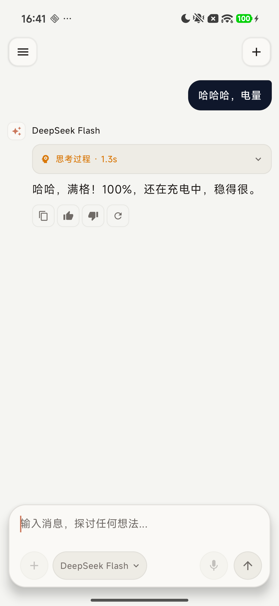

# Android AI Native Agent

<p align="left">
  
  
  
  
  
  
  
</p>

一个运行在普通第三方 Android 应用中的 AI Agent 学习与实践项目，基于 **Kotlin Multiplatform + Compose Multiplatform** 构建。

项目当前已完成 DeepSeek 多轮流式聊天、思考过程展示，以及第一个端侧 Tool Calling：模型可以请求应用读取手机真实电量与充电状态，再结合工具结果生成自然语言回答。

> 本项目不依赖 Root、系统签名或系统级权限，目标是在普通 Android 应用权限边界内逐步实现可解释、可测试的 Agent Runtime。

## 界面预览

<p align="center">
  
</p>

上图展示了完整的电量工具调用链：用户询问电量，模型生成 `get_battery_level` 调用，应用通过 Android `BatteryManager` 读取设备状态，再由模型输出最终回答。

## 已实现能力

- DeepSeek OpenAI-compatible API 接入
- 多轮聊天与模型切换
- SSE 流式响应
- 思考过程与正式回答分离展示
- Markdown 流式渲染
- 停止生成、失败重试与部分内容保留
- 单一 Tool Calling：`get_battery_level`
- Tool Call 参数分片聚合与协议校验
- 工具调用 ID 与结果消息关联
- 手机电量百分比、充电状态读取
- 工具异常、非法参数、重复调用与取消处理
- 最小调用链 Trace：LLM 请求 → Tool Call → Tool Result → 最终回答
- 暖石与 Terracotta 风格的自定义聊天 UI

## Tool Calling 流程

```text
用户询问手机电量
        ↓
DeepSeek 返回 get_battery_level Tool Call
        ↓
应用校验工具名、参数与调用次数
        ↓
Android BatteryManager 读取电量和充电状态
        ↓
应用回填 Assistant Tool Call + Tool Result
        ↓
DeepSeek 流式生成最终自然语言回答
```

当前严格限制为**单工具、单次执行、最多两次 LLM 请求**，暂未实现通用 Tool Registry 和多步 Agent Loop，避免在学习路线中提前引入不必要的复杂度。

## 技术栈

| 类别 | 技术 |
|---|---|
| 语言 | Kotlin 2.4 |
| UI | Compose Multiplatform、Material 3 |
| 架构 | Kotlin Multiplatform、ViewModel、StateFlow |
| 并发 | Kotlin Coroutines、Flow |
| 网络 | Ktor Client、OkHttp、SSE |
| 序列化 | Kotlinx Serialization |
| Markdown | multiplatform-markdown-renderer |
| 模型 | DeepSeek OpenAI-compatible Chat Completions API |
| Android API | BatteryManager |
| 构建 | Gradle 9、Android Gradle Plugin 9 |

## 模块结构

```text
AiNativeAgent/
├── androidApp/          Android 应用入口与平台依赖装配
├── shared/              Compose 应用组合根
├── chat/
│   ├── ui/              无业务依赖的聊天 UI、主题与状态契约
│   └── vm/              ChatViewModel、流式编排、单工具执行器
├── llm/
│   ├── core/            模型无关的消息、请求、流事件与 Tool Call 协议
│   ├── net/             Ktor Client 与 SSE 基础设施
│   └── deepseek/        DeepSeek 请求 DTO、协议转换与流解析
└── tool/
    ├── core/            工具执行结果与统一错误结构
    └── battery/         电量工具契约、纯逻辑与 Android 实现
```

核心依赖方向：

```text
androidApp → shared → chat:vm → llm:core
                   ↘ llm:deepseek → llm:net
                   ↘ tool:battery → tool:core
```

`chat:ui` 保持为纯 UI 组件；Android `Context` 只存在于平台组合边界，不进入 `commonMain`、ViewModel 或 LLM 层。

## 环境要求

- Android Studio 或 IntelliJ IDEA
- JDK 17+
- Android SDK 36
- Android 10（API 29）及以上设备或模拟器
- DeepSeek API Key

## 快速开始

### 1. 配置 DeepSeek API Key

在项目根目录的 `local.properties` 中加入：

```properties
DEEPSEEK_API_KEY=你的_API_Key
```

如果文件中已经存在 `sdk.dir`，保留原配置并追加上述字段即可。`local.properties` 已被 Git 忽略。

> API Key 会在本地构建时写入 `BuildConfig`，仅适用于学习和调试。正式产品应通过安全后端代理模型请求，不应把长期密钥打包进 APK。

### 2. 构建 Debug APK

```bash
./gradlew :androidApp:assembleDebug
```

APK 输出目录：

```text
androidApp/build/outputs/apk/debug/
```

### 3. 安装到设备

连接 Android 设备或启动模拟器后执行：

```bash
./gradlew installDebug
```

也可以直接通过 Android Studio 运行 `androidApp`。

### 4. 验证 Tool Calling

启动应用后输入类似问题：

```text
我手机还剩多少电？
```

模型应调用 `get_battery_level`，并回答设备当前电量及是否正在充电。读取电量不需要额外 Manifest 权限或运行时授权。

## 测试与检查

运行主要 JVM Host 测试：

```bash
./gradlew \
  :chat:vm:testAndroidHostTest \
  :llm:deepseek:testAndroidHostTest \
  :tool:battery:testAndroidHostTest \
  :shared:testAndroidHostTest
```

构建与 Android Lint：

```bash
./gradlew :androidApp:assembleDebug :androidApp:lintDebug
```

只运行 DeepSeek 流协议单元测试：

```bash
./gradlew :llm:deepseek:testAndroidHostTest \
  --tests "com.yongda.ainativeagent.llm.deepseek.DeepSeekStreamTest"
```

`DeepSeekProviderIntegrationTest` 在检测到 API Key 时会进行真实网络请求；离线环境可只运行上面的协议单元测试。

## 当前边界

- 目前仅支持 Android 目标。
- 当前只有一个只读工具：获取电量。
- 不具备系统级设备控制能力。
- 不使用 Root、系统签名或隐藏 API。
- Tool Calling 每轮最多执行一次，不支持自动多步循环。
- API Key 的本地注入方式只面向开发调试。

## 后续方向

项目会按可运行、可演示、可测试的顺序逐步演进：

1. Tool Registry
2. Multi-Step Agent Loop
3. Human-in-the-loop 与权限确认
4. Context Manager 与 Token Budget
5. Task Manager 与 Memory
6. MCP 接入
7. MNN 端侧模型与云端/端侧路由
8. Trace、恢复机制与性能评测

## 设计原则

- 先实现最小闭环，再扩展抽象。
- 模型只能提出工具调用，实际执行权始终由应用掌握。
- Android 平台能力保持在平台边界内。
- 所有工具参数必须完整聚合、校验后才能执行。
- 权限拒绝、工具失败和协议异常必须明确返回，不伪造成功结果。
- UI、Agent 编排、工具和模型协议保持清晰依赖边界。
